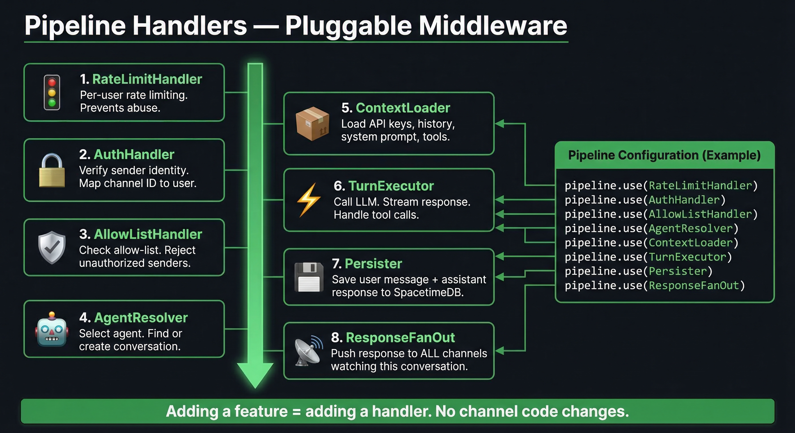

# Design Doc 032: Unified Message Pipeline Architecture

**Status:** Proposed  
**Author:** Developer  
**Date:** 2026-03-10  
**Depends on:** 031 (Channels)

---

## Problem

Bond has two separate code paths for handling inbound messages — one for WebChat and one for Telegram/WhatsApp. Both paths do roughly the same thing (authenticate, resolve agent, load context, execute turn, respond) but they do it differently, in different files, with different bugs.

This was discovered today when Telegram messages silently failed because the conversations turn endpoint had `api_keys = {}` with a TODO comment. The WebChat path happened to work because of environment variable fallbacks, but the underlying issue is the same: **there is no single pipeline that all messages flow through.**

### Current State


| Problem | Impact |
|---|---|
| Duplicate routing logic | Bug fixed in one path, not the other |
| API keys loaded in one path, not the other | Blank agent responses from Telegram |
| Cross-channel push bolted on as afterthought | Unreliable message delivery between channels |
| Auth/allowlist handled differently per channel | Security gaps |
| No shared middleware | Every new feature must be implemented N times |

### Files involved today

| File | Responsibility | Problems |
|---|---|---|
| `gateway/src/channels/webchat.ts` | WebChat message handling, streaming, fan-out | 460+ lines, handles auth + routing + streaming + persistence notifications |
| `gateway/src/channels/manager.ts` | Telegram/WhatsApp routing, commands, agent selection | Separate routing logic, separate conversation management |
| `backend/app/api/v1/conversations.py` | Turn execution, context loading, container management | 680+ lines, API key loading was missing, history loading is fragile |
| `backend/app/api/v1/agent.py` | Old turn execution path (has API key loading) | Duplicate of conversations.py turn logic |

---

## Proposed Architecture


### Core Concept

Every message — regardless of source channel — enters a **single pipeline** composed of ordered handlers. Each handler has one job. The pipeline is the same for WebChat, Telegram, WhatsApp, Discord, Slack, or any future channel.

This is the MediatR pattern: a mediator dispatches a request through a series of behaviors (handlers), each of which can inspect, modify, short-circuit, or pass through.

### Pipeline Message Type

```typescript
interface PipelineMessage {
  // Identity
  id: string;                    // ULID
  channelType: string;           // "webchat" | "telegram" | "whatsapp" | ...
  channelId: string;             // Channel-specific sender ID
  
  // Content
  content: string;               // The user's message text
  
  // Resolved by handlers (populated as message flows through pipeline)
  userId?: string;               // Resolved user identity
  agentId?: string;              // Selected agent
  conversationId?: string;       // Resolved conversation
  apiKeys?: Record<string, string>;  // Decrypted API keys
  history?: Array<{ role: string; content: string }>;  // Conversation history
  systemPrompt?: string;         // Agent's system prompt
  tools?: string[];              // Agent's enabled tools
  
  // Response (populated by TurnExecutor)
  response?: string;             // Full agent response text
  responseStream?: AsyncGenerator<SSEEvent>;  // Streaming response
  
  // Metadata
  timestamp: number;
  metadata: Record<string, any>;
}
```

### Pipeline Handler Interface

```typescript
interface PipelineHandler {
  name: string;
  
  /**
   * Process a message. Call next() to continue the pipeline,
   * or return early to short-circuit (e.g., auth rejection).
   */
  handle(
    message: PipelineMessage,
    context: PipelineContext,
    next: () => Promise<void>,
  ): Promise<void>;
}

interface PipelineContext {
  /** Send a response back to the originating channel */
  respond(text: string): Promise<void>;
  
  /** Send a response to ALL channels watching this conversation */
  broadcast(text: string): Promise<void>;
  
  /** Stream chunks to all watching channels */
  streamChunk(chunk: string): Promise<void>;
  
  /** Abort the pipeline with an error */
  abort(reason: string): Promise<void>;
}
```

### Pipeline Configuration

```typescript
const pipeline = new MessagePipeline();

pipeline.use(new RateLimitHandler());      // 1. Rate limiting
pipeline.use(new AuthHandler());           // 2. Sender identity
pipeline.use(new AllowListHandler());      // 3. Authorization
pipeline.use(new AgentResolver());         // 4. Agent + conversation
pipeline.use(new ContextLoader());         // 5. API keys, history, prompt
pipeline.use(new TurnExecutor());          // 6. LLM call + streaming
pipeline.use(new Persister());             // 7. Save to SpacetimeDB
pipeline.use(new ResponseFanOut());        // 8. Push to all channels
```



---

## Handler Specifications

### 1. RateLimitHandler

**Purpose:** Prevent abuse and runaway costs.

```typescript
class RateLimitHandler implements PipelineHandler {
  name = "rate-limit";
  
  // Per-user sliding window: 20 messages/minute, 200/hour
  // Per-agent: 100 concurrent turns max
  // Configurable per agent in settings
  
  async handle(msg, ctx, next) {
    if (this.isRateLimited(msg.userId || msg.channelId)) {
      await ctx.respond("⏳ Slow down — too many messages. Try again in a moment.");
      return; // Short-circuit
    }
    this.increment(msg.userId || msg.channelId);
    await next();
  }
}
```

### 2. AuthHandler

**Purpose:** Map channel-specific IDs to Bond user identities.

```typescript
class AuthHandler implements PipelineHandler {
  name = "auth";
  
  // Maps: telegram:8043842337 → user:andrew
  //        webchat:session-abc → user:andrew
  //        whatsapp:+1234567890 → user:andrew
  
  // For now: all authenticated channel users map to the owner.
  // Future: multi-user support with user table in SpacetimeDB.
  
  async handle(msg, ctx, next) {
    msg.userId = await this.resolveUser(msg.channelType, msg.channelId);
    if (!msg.userId) {
      await ctx.respond("❌ Not recognized. Send /start to register.");
      return;
    }
    await next();
  }
}
```

### 3. AllowListHandler

**Purpose:** Enforce per-channel allow-lists.

```typescript
class AllowListHandler implements PipelineHandler {
  name = "allow-list";
  
  async handle(msg, ctx, next) {
    // WebChat: always allowed (authenticated via session)
    // Telegram/WhatsApp: check allow-list
    if (!this.isAllowed(msg.channelType, msg.channelId)) {
      // Silent reject — don't reveal the bot exists to strangers
      return;
    }
    await next();
  }
}
```

### 4. AgentResolver

**Purpose:** Determine which agent handles this message and which conversation it belongs to.

```typescript
class AgentResolver implements PipelineHandler {
  name = "agent-resolver";
  
  async handle(msg, ctx, next) {
    // 1. Check if channel has an active agent selection (from /agent command)
    // 2. Check if conversation already exists (from channel binding)
    // 3. Fall back to default agent
    // 4. Find or create conversation
    
    msg.agentId = await this.resolveAgent(msg);
    msg.conversationId = await this.resolveConversation(msg);
    
    await next();
  }
}
```

### 5. ContextLoader

**Purpose:** Load everything the agent needs to execute a turn.

```typescript
class ContextLoader implements PipelineHandler {
  name = "context-loader";
  
  async handle(msg, ctx, next) {
    // Load from SpacetimeDB in parallel
    const [apiKeys, history, agent] = await Promise.all([
      this.loadApiKeys(),          // provider_api_keys table, decrypt
      this.loadHistory(msg.conversationId),  // conversation_messages
      this.loadAgent(msg.agentId), // agents table
    ]);
    
    msg.apiKeys = apiKeys;
    msg.history = history;
    msg.systemPrompt = agent.systemPrompt;
    msg.tools = agent.tools;
    
    await next();
  }
}
```

### 6. TurnExecutor

**Purpose:** Call the LLM and stream the response.

```typescript
class TurnExecutor implements PipelineHandler {
  name = "turn-executor";
  
  async handle(msg, ctx, next) {
    // Route to container or host-mode agent
    // Stream response chunks via ctx.streamChunk()
    // Accumulate full response in msg.response
    
    for await (const event of this.executeTurn(msg)) {
      if (event.type === "chunk") {
        await ctx.streamChunk(event.content);
        msg.response = (msg.response || "") + event.content;
      }
    }
    
    await next();
  }
}
```

### 7. Persister

**Purpose:** Save the user message and agent response to SpacetimeDB.

```typescript
class Persister implements PipelineHandler {
  name = "persister";
  
  async handle(msg, ctx, next) {
    // Save user message (if not already saved by TurnExecutor)
    await this.saveMessage(msg.conversationId, "user", msg.content);
    
    // Save assistant response
    if (msg.response) {
      await this.saveMessage(msg.conversationId, "assistant", msg.response);
    }
    
    // Auto-title if first message
    await this.autoTitle(msg.conversationId, msg.content);
    
    await next();
  }
}
```

### 8. ResponseFanOut

**Purpose:** Push the response to ALL channels watching this conversation.

```typescript
class ResponseFanOut implements PipelineHandler {
  name = "response-fan-out";
  
  async handle(msg, ctx, next) {
    // Find all channels watching msg.conversationId
    // Push the complete response to each one
    // Skip the originating channel (they already got the stream)
    
    const watchers = this.getWatchers(msg.conversationId);
    for (const watcher of watchers) {
      if (watcher.channelType === msg.channelType && watcher.channelId === msg.channelId) {
        continue; // Already received via streaming
      }
      await this.pushToChannel(watcher, msg.response);
    }
    
    await next();
  }
}
```

---

## Channel Adapters

Channel adapters are thin. Their only job is to translate between channel-specific protocols and `PipelineMessage`.

```typescript
interface ChannelAdapter {
  channelType: string;
  
  /** Start listening for inbound messages */
  start(): Promise<void>;
  
  /** Stop listening */
  stop(): Promise<void>;
  
  /** Send a message to a specific channel ID */
  send(channelId: string, message: string): Promise<void>;
  
  /** Register the pipeline to receive messages */
  onMessage(handler: (msg: PipelineMessage) => Promise<void>): void;
}
```

### WebChat Adapter

```typescript
class WebChatAdapter implements ChannelAdapter {
  channelType = "webchat";
  
  // Handles WebSocket connections
  // Translates WS messages → PipelineMessage
  // Translates pipeline responses → WS messages
  // Manages streaming (chunks → WebSocket frames)
}
```

### Telegram Adapter

```typescript
class TelegramAdapter implements ChannelAdapter {
  channelType = "telegram";
  
  // Handles grammY bot
  // Translates Telegram messages → PipelineMessage
  // Handles /commands locally (before pipeline)
  // Sends responses via bot.api.sendMessage with chunking
}
```

### WhatsApp Adapter

```typescript
class WhatsAppAdapter implements ChannelAdapter {
  channelType = "whatsapp";
  
  // Handles Baileys connection
  // Translates WhatsApp messages → PipelineMessage
  // QR code auth flow
  // Sends responses via sock.sendMessage
}
```

---

## Migration Plan

### Phase 1: Create the Pipeline (gateway-side)

1. Create `gateway/src/pipeline/types.ts` — PipelineMessage, PipelineHandler, PipelineContext interfaces
2. Create `gateway/src/pipeline/pipeline.ts` — MessagePipeline class with `.use()` and `.execute()`
3. Create stub handlers that wrap existing logic:
   - `AllowListHandler` — wraps existing allowlist.ts
   - `AgentResolver` — wraps existing conversation resolution logic
   - `ResponseFanOut` — wraps existing cross-channel push

### Phase 2: Migrate WebChat to Pipeline

1. Refactor `webchat.ts` to be a thin adapter
2. Extract routing logic into pipeline handlers
3. WebChat sends PipelineMessage, receives responses via PipelineContext
4. Run both old and new paths in parallel (shadow mode) to verify

### Phase 3: Migrate Telegram/WhatsApp to Pipeline

1. Refactor `manager.ts` — remove routing logic, keep only command parsing
2. Telegram and WhatsApp adapters send PipelineMessage to same pipeline
3. Delete duplicate code in manager.ts

### Phase 4: Unify Backend Turn Execution

1. Move API key loading, history loading, agent lookup into ContextLoader handler
2. Delete duplicate code in `conversations.py` and `agent.py`
3. Single `TurnExecutor` that handles both container and host-mode agents

### Phase 5: Add New Handlers

1. RateLimitHandler
2. AuthHandler (multi-user preparation)
3. ContentFilter (optional, for safety)
4. AuditLogger (log all messages for compliance)

---

## Channel Watcher Registry

A critical component for cross-channel communication: knowing which channels are watching which conversations.

```typescript
class ChannelWatcherRegistry {
  // Map: conversationId → Set of { channelType, channelId }
  private watchers = new Map<string, Set<ChannelBinding>>();
  
  /** Register a channel as watching a conversation */
  watch(conversationId: string, channelType: string, channelId: string): void;
  
  /** Unregister */
  unwatch(conversationId: string, channelType: string, channelId: string): void;
  
  /** Get all channels watching a conversation */
  getWatchers(conversationId: string): ChannelBinding[];
  
  /** Get the conversation a channel is currently watching */
  getConversation(channelType: string, channelId: string): string | null;
}
```

**When channels register:**
- WebChat: when a user switches to a conversation (`switch_conversation`)
- Telegram: when a message is sent (auto-registers for that conversation)
- WhatsApp: same as Telegram

**When channels unregister:**
- WebChat: when the user switches away or disconnects
- Telegram: on `/new` command
- WhatsApp: on `/new` command

---

## What This Enables

| Feature | Today | With Pipeline |
|---|---|---|
| New channel (Discord) | Write adapter + routing + response logic | Write adapter only |
| Rate limiting | Not implemented | Add one handler, applies everywhere |
| Message logging | Not implemented | Add one handler, applies everywhere |
| Content filtering | Not implemented | Add one handler, applies everywhere |
| API key loading | Broken in one path | One handler, tested once |
| Cross-channel push | Bolted on, fragile | Built into ResponseFanOut handler |
| Multi-user auth | Not possible | AuthHandler maps channel IDs to users |

---

## Testing Strategy

### Unit Tests

Each handler tested independently with mock PipelineContext:

```typescript
describe("ContextLoader", () => {
  it("loads API keys from SpacetimeDB", async () => {
    const msg = createTestMessage();
    const handler = new ContextLoader(mockStdb);
    await handler.handle(msg, mockContext, mockNext);
    expect(msg.apiKeys).toHaveProperty("anthropic");
  });
  
  it("falls back to env vars if SpacetimeDB fails", async () => {
    const msg = createTestMessage();
    const handler = new ContextLoader(failingStdb);
    await handler.handle(msg, mockContext, mockNext);
    expect(msg.apiKeys).toHaveProperty("anthropic"); // from env
  });
});
```

### Integration Tests

Full pipeline with mock LLM:

```typescript
describe("Pipeline integration", () => {
  it("routes a Telegram message through all handlers", async () => {
    const pipeline = createTestPipeline();
    const msg = createTelegramMessage("Hello from Telegram");
    await pipeline.execute(msg);
    
    expect(msg.userId).toBeDefined();
    expect(msg.agentId).toBeDefined();
    expect(msg.conversationId).toBeDefined();
    expect(msg.response).toContain("Hello");
  });
});
```

### Shadow Mode

During migration, run both old and new paths. Compare results. Log discrepancies. Switch over when confident.

---

## Estimated Effort

| Phase | Effort | Risk |
|---|---|---|
| Phase 1: Pipeline framework | 1 day | Low — new code, no existing behavior changes |
| Phase 2: WebChat migration | 2 days | Medium — webchat.ts is 460+ lines with streaming |
| Phase 3: Telegram/WhatsApp migration | 1 day | Low — already simpler than webchat |
| Phase 4: Backend unification | 2 days | High — conversations.py is 680+ lines |
| Phase 5: New handlers | 1 day per handler | Low — isolated, testable |

**Total: ~7-8 days for full migration.**

---

## Decision

This is not optional. Every new channel we add multiplies the problem. Every new cross-cutting feature (auth, rate limiting, logging) currently requires changes in every channel handler. The pipeline pattern eliminates this multiplication.

The API key bug we found today — `api_keys = {}` in conversations.py — is a direct consequence of duplicate code paths. That class of bug becomes structurally impossible with a pipeline.
