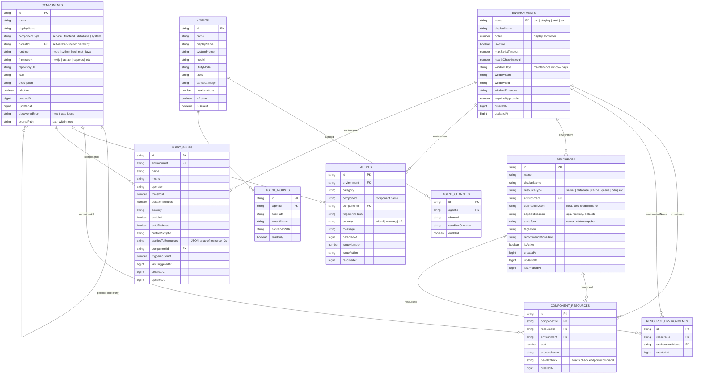

# Bond Deployment Data Model — ER Diagram

## Why This Document Exists

The Deploy tab implementation (Design Doc 061) incorrectly treated **Agents** as **Apps**. They are not the same thing. This document maps the actual data entities in Bond's SpacetimeDB schema that are relevant to deployment, so the Deploy screens can be rebuilt on the correct foundation.

---

## Key Insight: Bond Has No "App" Entity

**Bond does not have an `apps` table.** The closest concept is a **Component** — a deployable unit (service, frontend, database, system) that lives in a repository, runs on a framework, and gets deployed to environments via resources.

**Agents** are AI assistants that _operate on_ deployments. They are not the things being deployed.

---

## Entity Relationship Diagram (Mermaid)



---

## What Each Entity Means for Deployment

| Entity | Role in Deployment | Example |
|--------|-------------------|---------|
| **Component** | **The thing being deployed.** A service, frontend, database, or system. Has a repo URL, framework, runtime. Can be hierarchical (system → children). | `bond-api` (service, Python/FastAPI), `bond-frontend` (frontend, Next.js) |
| **Environment** | **Where it gets deployed to.** Defines deployment windows, approval requirements, health check intervals. | `dev`, `staging`, `prod` |
| **Resource** | **Infrastructure it runs on.** A server, database instance, cache, CDN. Has connection info, capabilities (CPU/RAM), and current state. | `prod-server-1` (server), `prod-postgres` (database) |
| **ComponentResource** | **The binding between a component and a resource in an environment.** Defines which port, process name, and health check to use. | `bond-api` runs on `prod-server-1` on port 8080, health check `/health` |
| **ResourceEnvironment** | **Which resources belong to which environments.** A resource can span multiple environments. | `shared-redis` is in both `staging` and `prod` |
| **Alert** | **Runtime monitoring events.** Tied to a component and environment. | "bond-api CPU > 90% in prod" |
| **AlertRule** | **Monitoring rules that trigger alerts.** Configurable thresholds, auto-issue filing. | "If CPU > 80% for 5 min on bond-api in prod, create critical alert" |
| **Agent** | **AI assistant that _operates on_ deployments.** NOT an app. NOT a component. Agents run deployment scripts, respond to alerts, etc. | `deploy-prod` agent handles prod deployments |

---

## What the Deploy Screens Should Show

### ❌ Current (Wrong)
```
Deploy Tab → Lists AGENTS as "apps"
             Agent name → parsed as app name
             Agent suffix → parsed as environment
```

### ✅ Correct
```
Deploy Tab → Lists COMPONENTS (the actual deployable units)
             Each component → shows its ENVIRONMENTS via COMPONENT_RESOURCES
             Each environment → shows RESOURCES (servers, DBs) and their state
             ALERTS → shown per component per environment
             AGENTS → available as "operators" you can assign to manage a component
```

### Screen-to-Entity Mapping

| Screen | Primary Entity | Related Entities |
|--------|---------------|-----------------|
| **App Dashboard** (card grid) | `components` (where componentType ≠ "system" or is top-level) | `component_resources` → `resources` (for health/status), `environments` (for env pills), `alerts` (for alert badges) |
| **App Detail → Overview** | `components` (single) | `component_resources` → `resources` (servers list), `environments` (tabs), `alerts` (recent alerts) |
| **App Detail → Monitoring** | `alerts` + `alert_rules` | Filtered by `componentId` and `environment` |
| **App Detail → Env Vars** | `resources` | `connectionJson`, `stateJson` for the resources bound to this component |
| **Infrastructure tab** | `resources` + `environments` | `resource_environments` (which envs a resource belongs to), `resources.capabilitiesJson` (CPU/RAM gauges) |
| **Ship Wizard → Connect** | Creates a new `component` | Sets `repositoryUrl`, detects `framework`/`runtime` |
| **Ship Wizard → Discover** | Enriches `component` | Auto-detects children (sub-components), suggests `resources` |
| **Ship Wizard → Deploy** | Creates `component_resources` bindings | Binds component to resources in target environment |

---

## Gateway REST API Endpoints (Existing)

These endpoints already exist in the Gateway and serve the deployment data:

| Endpoint | Returns |
|----------|---------|
| `GET /api/v1/deployments/components` | All components (optional `?environment=` filter) |
| `GET /api/v1/deployments/components/:id` | Single component |
| `GET /api/v1/deployments/components/:id/status?environment=` | Component health in an environment |
| `GET /api/v1/deployments/environments` | All environments |
| `GET /api/v1/deployments/environments/:name` | Single environment |
| `GET /api/v1/deployments/environments/:name/history` | Deployment history for environment |
| `GET /api/v1/deployments/resources` | All resources (optional `?environment=` filter) |
| `GET /api/v1/deployments/resources/:id` | Single resource |
| `GET /api/v1/deployments/promotions` | Promotion records |
| `GET /api/v1/deployments/scripts` | Deployment scripts |
| `GET /api/v1/deployments/queue/:env` | Deployment queue for environment |
| `GET /api/v1/deployments/health/:env` | Health status for environment |
| `GET /api/v1/deployments/monitoring/:env` | Monitoring data for environment |
| `GET /api/v1/deployments/receipts/:env` | Deployment receipts (history) |

---

## Summary

The deploy screens must be rebuilt around **Components**, **Environments**, and **Resources** — the actual deployment domain model. Agents are operators, not applications. The SpacetimeDB tables and Gateway REST APIs already have all the data needed. The `AppDashboard.tsx` needs to query `useComponents()` and `useResources()`, not `useAgentsWithRelations()`.
