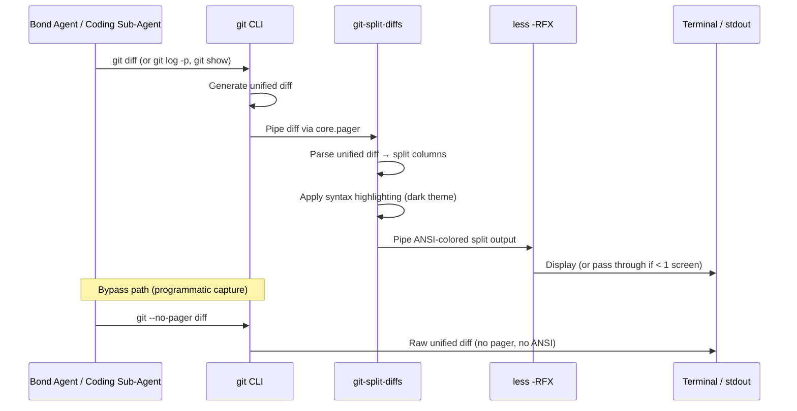
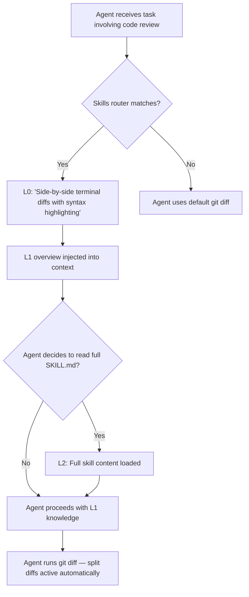

# Design Doc 076: git-split-diffs — Side-by-Side Diff Skill for Agents

**Status:** Proposed
**Author:** Bond Agent
**Date:** 2025-03-26
**Depends on:** [Design Doc 037](./037-coding-agent-skill.md) (Coding Agent Skill), [Design Doc 047](./047-skills-federation.md) (Skills Federation), [Design Doc 008](./008-containerized-agent-runtime.md) (Containerized Agent Runtime)

---

## Revision History

| Version | Date       | Author      | Changes                          |
|---------|------------|-------------|----------------------------------|
| 0.1     | 2025-03-26 | Bond Agent  | Initial proposal                 |
| 0.2     | 2026-03-25 | Bond Agent  | Enterprise review: added security, rollback, monitoring, alternatives matrix, acceptance criteria, diagrams |

---

## Stakeholders & Audience

| Role                        | Interest                                                                 |
|-----------------------------|--------------------------------------------------------------------------|
| Agent Runtime / DevOps      | Docker image changes, build pipeline, image size impact                  |
| Skill Catalog Maintainers   | New skill entry in `skills.json`, SKILL.md authoring conventions         |
| Coding Agent Developers     | Pager interaction with programmatic stdout capture (`--no-pager` usage)  |
| Bond Agent (end-user agent) | Improved self-review of diffs before committing                          |

---

## 1. Problem

When Bond or a coding sub-agent (Claude Code, Codex) reviews diffs — via `git diff`, `git log -p`, or `git show` — the output is a standard unified diff. Unified diffs are:

1. **Hard to parse visually** — additions and deletions are interleaved, making it difficult to see what changed on a specific line.
2. **Missing syntax highlighting** — raw diff output has no language-aware coloring, reducing readability for complex changes.
3. **Suboptimal for agents reviewing their own work** — the system prompt instructs agents to `git diff` before finishing. A clearer diff means better self-review and fewer mistakes shipped.

GitHub's web UI solves this with side-by-side (split) diffs and syntax highlighting. [git-split-diffs](https://github.com/banga/git-split-diffs) brings the same experience to the terminal.

---

## 2. Proposed Solution

1. **Install `git-split-diffs` in `Dockerfile.agent`** so it's available in every agent container.
2. **Configure git to use it as the default pager** so all `git diff`, `git log -p`, and `git show` commands automatically produce split, syntax-highlighted output.
3. **Create a `git-split-diffs` skill** in the skills catalog (per [Design Doc 047](./047-skills-federation.md)) so agents know how to use it, configure it, and fall back to plain diffs when needed (e.g., piping to a file, narrow terminals).

---

## 3. Design

### 3.1 Integration Flow

The following diagram shows how `git-split-diffs` integrates into the git pager pipeline:



### 3.2 Skill Discovery & Loading Flow



### 3.3 Docker Image Changes

**File:** `Dockerfile.agent`

Add after the existing Node.js / Claude Code / Codex CLI installation block:

```dockerfile
# git-split-diffs — GitHub-style side-by-side diffs in terminal (Design Doc 076)
RUN npm install -g git-split-diffs
```

Configure git to use it as the default pager for the `bond-agent` user:

```dockerfile
# Configure git-split-diffs as default pager for bond-agent
RUN git config --global core.pager "git-split-diffs --color | less -RFX" && \
    git config --global split-diffs.theme-name "dark" && \
    git config --global split-diffs.min-line-width 40 && \
    git config --global split-diffs.highlight-line-changes true
```

**Why global config in the image:**
- Every agent container gets split diffs by default — zero per-repo setup.
- The `min-line-width 40` setting ensures graceful fallback to unified diffs on narrow terminals (< 80 cols).
- The `dark` theme is appropriate for terminal environments where agents operate.

**Layer placement:** After Node.js installation (depends on `npm`), before the non-root user creation so the gitconfig is in `/root/.gitconfig` and gets inherited. Alternatively, place it after user creation and use `su - bond-agent -c "git config --global ..."`.

### 3.4 Skill Definition

**File:** `skills/git-split-diffs/SKILL.md`

```markdown
---
name: git-split-diffs
description: >
  View side-by-side (split) diffs with syntax highlighting in the terminal.
  Use when reviewing code changes, comparing branches, or inspecting commits.
  Automatically active as the git pager — all git diff, git log -p, and git show
  commands produce split diffs by default.
---

# git-split-diffs

GitHub-style side-by-side diffs with syntax highlighting, directly in the terminal.

## How It Works

git-split-diffs is pre-installed and configured as the default git pager.
All diff commands automatically produce split output:

- `git diff` — working tree changes
- `git diff --staged` — staged changes
- `git log -p` — commit history with patches
- `git show <commit>` — single commit details
- `git diff branch1..branch2` — branch comparison

## Piping Diffs Directly

You can also pipe any diff content through it:

    git diff | git-split-diffs --color | less -RFX

Or compare arbitrary files:

    diff -u file1.txt file2.txt | git-split-diffs --color | less -RFX

## Configuration

Settings are managed via git config:

    # Switch theme (dark, light, arctic, github-dark-dim, github-light, solarized-dark, solarized-light, monochrome-dark, monochrome-light)
    git config --global split-diffs.theme-name dark

    # Disable line wrapping (truncate instead)
    git config --global split-diffs.wrap-lines false

    # Disable inline change highlighting
    git config --global split-diffs.highlight-line-changes false

    # Set minimum line width before falling back to unified diff
    git config --global split-diffs.min-line-width 40

    # Disable syntax highlighting
    git config --global split-diffs.syntax-highlighting-theme ''

## Disabling for a Single Command

To bypass split diffs and get raw unified output (useful for piping to files or other tools):

    GIT_PAGER=cat git diff
    git --no-pager diff
    git diff > output.patch  # redirects bypass the pager automatically

## When to Use Plain Diffs Instead

- When saving diff output to a `.patch` file
- When piping diff output to another tool (grep, wc, etc.)
- When the terminal width is very narrow (< 80 columns)
- When you need machine-parseable unified diff format

## Troubleshooting

If colors look wrong, try forcing true color:

    git-split-diffs --color=16m

If the pager isn't activating, verify the config:

    git config --get core.pager
    # Should output: git-split-diffs --color | less -RFX
```

### 3.5 Skills Catalog Entry

**File:** `skills.json` — add entry:

```json
{
  "id": "bond/git-split-diffs",
  "name": "git-split-diffs",
  "source": "bond",
  "source_type": "local",
  "path": "skills/git-split-diffs/SKILL.md",
  "description": "View side-by-side (split) diffs with syntax highlighting in the terminal. Pre-installed as the default git pager. Use when reviewing code changes, comparing branches, or inspecting commits.",
  "l0_summary": "Side-by-side terminal diffs with syntax highlighting.",
  "l1_overview": "# git-split-diffs\n\nPre-installed as the default git pager. All `git diff`, `git log -p`, and `git show` commands automatically produce GitHub-style split diffs with syntax highlighting.\n\n## Key Commands\n\n```bash\n# Normal usage — just use git as usual\ngit diff\ngit diff --staged\ngit log -p\ngit show <commit>\ngit diff branch1..branch2\n\n# Pipe arbitrary diffs\ndiff -u file1 file2 | git-split-diffs --color | less -RFX\n\n# Bypass split diffs for raw output\ngit --no-pager diff\nGIT_PAGER=cat git diff\n```\n\n## Configuration\n\n```bash\ngit config --global split-diffs.theme-name dark    # Theme\ngit config --global split-diffs.min-line-width 40   # Fallback threshold\ngit config --global split-diffs.wrap-lines false     # Truncate instead of wrap\n```\n\n## When NOT to use\n\n- Saving to `.patch` files (use `git --no-pager diff`)\n- Piping to grep/wc (use `GIT_PAGER=cat`)\n- Machine-parseable output needed"
}
```

### 3.6 Coding Agent Awareness

Coding sub-agents (Claude Code, Codex) inherit the git config from the container environment. No additional configuration is needed — when they run `git diff`, they get split diffs automatically.

However, there is one consideration: **coding agents capture stdout programmatically**. If the coding agent's git wrapper captures pager output, it may get ANSI escape codes mixed in. The safest approach:

- The entrypoint script or skill instructions should note that programmatic diff capture should use `git --no-pager diff` or `GIT_PAGER=cat`.
- Interactive review (agent looking at its own changes) benefits from the split view.

### 3.7 Prompt Fragment Integration

Add a note to the system prompt's "Before Finishing" section (or the relevant prompt fragment) so agents know split diffs are available:

```
### Diff Review
- `git diff` produces side-by-side split diffs with syntax highlighting by default.
- For raw/machine-parseable output, use `git --no-pager diff`.
```

---

## 4. Alternatives Considered

### 4.1 Decision Matrix

| Criteria                     | git-split-diffs | delta (dandavison/delta) | diff-so-fancy | Do Nothing |
|------------------------------|:---------------:|:------------------------:|:-------------:|:----------:|
| Side-by-side (split) view    | Yes             | Yes                      | No            | No         |
| Syntax highlighting          | Yes             | Yes (via bat/syntect)    | No            | No         |
| Language                     | Node.js         | Rust                     | Perl          | —          |
| Already have runtime in image| Yes (Node 22)   | No (needs Rust binary)   | No (needs Perl)| —         |
| Install size                 | ~2 MB           | ~8 MB                    | ~0.5 MB       | 0          |
| GitHub-style rendering       | Yes             | Partial                  | Partial       | No         |
| Configuration via git config | Yes             | Yes                      | Yes           | —          |
| Min-width auto-fallback      | Yes             | No (manual)              | N/A           | —          |
| Active maintenance           | Yes             | Yes                      | Low           | —          |
| License                      | MIT             | MIT                      | MIT           | —          |

### 4.2 Rationale

- **delta** is a strong alternative (Rust, fast, feature-rich) but requires adding a Rust binary to the image. Node.js is already present for Claude Code / Codex, making `git-split-diffs` a zero-new-runtime dependency. Delta also lacks the `min-line-width` auto-fallback to unified diffs that agents benefit from.
- **diff-so-fancy** improves unified diff readability but does not provide side-by-side views — the primary goal of this design.
- **Do nothing** is always an option. The cost is suboptimal agent self-review when diffs are large or complex. Given the ~50 minute implementation effort and ~2 MB image cost, the benefit-to-cost ratio strongly favors adoption.

---

## 5. Implementation Plan

| Phase | Task | Effort |
|-------|------|--------|
| 1 | Add `npm install -g git-split-diffs` to `Dockerfile.agent` | 5 min |
| 2 | Add git config lines to `Dockerfile.agent` | 5 min |
| 3 | Create `skills/git-split-diffs/SKILL.md` | 15 min |
| 4 | Add entry to `skills.json` | 5 min |
| 5 | Rebuild agent image and verify | 10 min |
| 6 | Test with coding agent sub-spawn | 10 min |

**Total estimated effort:** ~50 minutes

---

## 6. Dependencies & Compatibility Matrix

| Dependency     | Required Version | Notes                                                       |
|----------------|------------------|-------------------------------------------------------------|
| Node.js        | ≥ 14             | Image ships Node 22 — no risk                               |
| npm            | ≥ 6              | Bundled with Node 22                                         |
| git            | ≥ 2.x            | Any modern git; pager config is stable across versions       |
| OS             | Linux (Debian/Ubuntu) | Agent container base image                              |
| Architecture   | amd64, arm64     | `git-split-diffs` is pure JavaScript — no native binaries    |
| less           | Any              | Pre-installed in base image; `-RFX` flags are POSIX-standard |
| Terminal width | ≥ 80 cols recommended | Falls back to unified diff below `min-line-width` (40 cols) |

---

## 7. Security Considerations

| Concern                      | Assessment                                                                                       |
|------------------------------|--------------------------------------------------------------------------------------------------|
| **npm supply chain risk**    | `git-split-diffs` is installed at image build time, not runtime. The package is MIT-licensed, has a small dependency tree, and is pinned to a known version via `npm install -g git-split-diffs@<version>` in production builds. Verify integrity with `npm audit` in CI. |
| **Runtime network access**   | None required. `git-split-diffs` is a pure text transformation — it reads stdin and writes stdout. No network calls at runtime. |
| **Privilege level**          | Runs as the non-root `bond-agent` user (per [Design Doc 037](./037-coding-agent-skill.md) §4.4.1). No elevated privileges needed. |
| **Data exposure**            | Processes diff content only. Does not log, cache, or transmit diff content. Output is ephemeral (piped through `less`). |
| **ANSI injection**           | `git-split-diffs` produces ANSI escape codes. When output is captured programmatically, agents must use `--no-pager` to avoid escape code injection into tool results. Documented in skill instructions. |

**Recommendation:** Pin the npm package version in `Dockerfile.agent` for reproducible builds:
```dockerfile
RUN npm install -g git-split-diffs@2.1.0
```

---

## 8. Risks & Mitigations

| Risk | Impact | Mitigation |
|------|--------|------------|
| ANSI escape codes in programmatic diff capture | Garbled output in tool results | Document `--no-pager` usage in skill; coding agents already handle pager bypass |
| Image size increase | Larger pull times | `git-split-diffs` is ~2 MB installed; negligible vs. existing Node.js + Claude Code (~200 MB+) |
| Node.js version incompatibility | Tool fails to install | Already using Node 22 (requires ≥ 14); no risk |
| Narrow terminal fallback | Unexpected unified diffs | `min-line-width 40` is a sensible default; documented in skill |
| Pager blocks non-interactive scripts | Hanging processes | `less -RFX` flags: `-F` quits if output fits one screen, `-X` doesn't clear screen |
| npm package compromised upstream | Supply chain attack | Pin version, run `npm audit` in CI, review before version bumps |

---

## 9. Testing Strategy

### 9.1 Build Verification

```bash
# Build the image
docker build -f Dockerfile.agent -t bond-agent-test .

# Verify binary is installed
docker run --rm bond-agent-test which git-split-diffs
# Expected: /usr/local/bin/git-split-diffs (or /usr/lib/node_modules/.bin/git-split-diffs)

# Verify version
docker run --rm bond-agent-test git-split-diffs --version
# Expected: git-split-diffs <pinned-version>

# Verify git config
docker run --rm bond-agent-test git config --get core.pager
# Expected: git-split-diffs --color | less -RFX

docker run --rm bond-agent-test git config --get split-diffs.theme-name
# Expected: dark
```

### 9.2 Functional Tests

```bash
# Inside container: create a repo with a diff and verify split output
docker run --rm bond-agent-test bash -c '
  cd /tmp && git init test-repo && cd test-repo &&
  echo "hello" > file.txt && git add . && git commit -m "init" &&
  echo "world" >> file.txt &&
  git diff --color=always | head -20
'
# Expected: output contains split (two-column) formatting with ANSI color codes

# Verify --no-pager bypass works (critical for programmatic capture)
docker run --rm bond-agent-test bash -c '
  cd /tmp && git init test-repo && cd test-repo &&
  echo "hello" > file.txt && git add . && git commit -m "init" &&
  echo "world" >> file.txt &&
  git --no-pager diff
'
# Expected: standard unified diff, no ANSI codes, no split formatting
```

### 9.3 Skill Discovery Test

```bash
# Verify skill is in catalog
cat skills.json | jq '.[] | select(.id == "bond/git-split-diffs")'
# Expected: returns the skill entry

# Verify SKILL.md parses correctly (frontmatter + content)
head -10 skills/git-split-diffs/SKILL.md
# Expected: valid YAML frontmatter with name and description
```

### 9.4 Coding Agent Integration Test

Spawn a coding agent task (per [Design Doc 037](./037-coding-agent-skill.md)) that includes a `git diff` step. Verify:
- The sub-agent does not hang waiting for pager input.
- Output does not contain garbled ANSI escape codes in tool results.
- When agent uses `git --no-pager diff`, output is clean unified diff.

### 9.5 CI Integration

Add to the existing Docker image build CI step:
```yaml
# .github/workflows/docker-build.yml (addition)
- name: Verify git-split-diffs installation
  run: |
    docker run --rm bond-agent-test which git-split-diffs
    docker run --rm bond-agent-test git config --get core.pager
```

---

## 10. Cost Analysis

| Metric              | Impact                                                                   |
|---------------------|--------------------------------------------------------------------------|
| **Image size**      | +~2 MB (pure JS, no native binaries). Negligible vs. base image (~1.5 GB with Node.js + Claude Code + Codex). |
| **Build time**      | +~5 seconds (`npm install -g` of a small package). No compilation step.  |
| **Runtime overhead** | Near-zero for normal diffs. `git-split-diffs` processes text in a streaming pipeline — adds ~50–100 ms for large diffs (1000+ lines). |
| **Memory**          | Node.js process spawned per pager invocation. Typical RSS: ~30 MB, released immediately after diff display. |
| **Token cost**      | Zero additional LLM tokens. The skill is auto-active via git config; no skill routing overhead unless the agent explicitly queries the catalog. |

---

## 11. Monitoring & Observability

| Signal                          | How to Observe                                                        | Action on Failure                              |
|---------------------------------|-----------------------------------------------------------------------|------------------------------------------------|
| Binary present in image         | CI build step: `which git-split-diffs` (§9.5)                        | Build fails — fix Dockerfile                   |
| Git pager config correct        | CI build step: `git config --get core.pager` (§9.5)                  | Build fails — fix Dockerfile                   |
| Pager not hanging agent         | Coding agent integration test (§9.4); monitor for timeout events      | Check `less -RFX` flags; fall back to `cat`    |
| ANSI in tool results            | Grep agent tool output logs for ANSI escape sequences (`\x1b\[`)     | Agent or wrapper not using `--no-pager`; fix prompt fragment |
| npm package vulnerability       | `npm audit` in CI pipeline; Dependabot/Snyk alerts on Dockerfile      | Pin to last-known-good version; evaluate patch  |

No new application-level metrics are required. Failures surface through existing mechanisms (CI failures, agent task timeouts, garbled tool output in conversation logs).

---

## 12. Rollback Plan

If `git-split-diffs` causes issues (hanging processes, garbled output, image build failures):

1. **Immediate mitigation (no rebuild):** Override the pager at runtime via environment variable:
   ```bash
   # In agent-entrypoint.sh or container env
   export GIT_PAGER=cat
   ```
   This disables split diffs without removing the package.

2. **Full rollback (image rebuild):**
   - Remove the `npm install -g git-split-diffs` line from `Dockerfile.agent`.
   - Remove the `git config` lines for `core.pager`, `split-diffs.*`.
   - Remove `skills/git-split-diffs/SKILL.md` and the `skills.json` entry.
   - Rebuild and deploy the agent image.

3. **Skill catalog cleanup:** Remove the `bond/git-split-diffs` entry from `skills.json`. The skills router (per [Design Doc 047](./047-skills-federation.md)) will stop matching it on the next index refresh.

**Rollback effort:** ~10 minutes (option 1) or ~20 minutes (option 2, including rebuild and deploy).

---

## 13. Acceptance Criteria

| #  | Criterion                                                                                     | Pass Condition                                                      |
|----|-----------------------------------------------------------------------------------------------|---------------------------------------------------------------------|
| AC1 | `git-split-diffs` binary is present in the built agent Docker image                          | `docker run --rm <image> which git-split-diffs` exits 0             |
| AC2 | `git diff` produces side-by-side output inside the container                                  | Visual inspection shows two-column diff layout with color           |
| AC3 | `git --no-pager diff` produces standard unified diff (no ANSI, no split)                      | Output matches `diff -u` format, parseable by `patch`               |
| AC4 | Coding agent sub-spawn does not hang on `git diff`                                            | Agent completes diff review step within normal timeout               |
| AC5 | Skill appears in `skills.json` and is discoverable via catalog search                         | `jq` query for `bond/git-split-diffs` returns a result              |
| AC6 | `SKILL.md` has valid YAML frontmatter with `name` and `description`                           | Frontmatter parses without error                                     |
| AC7 | Image size increase is ≤ 5 MB                                                                 | `docker images` comparison before/after shows delta ≤ 5 MB          |
| AC8 | No `npm audit` critical/high vulnerabilities from `git-split-diffs`                           | `npm audit --global` reports no critical/high findings               |

---

## 14. Future Enhancements

- **Custom Bond theme:** Create a Bond-branded color theme for consistent visual identity.
- **Diff snapshots:** Capture split diff output as HTML for inclusion in PR descriptions or audit logs.
- **Integration with `shell_diff` tool:** Pipe `shell_diff` output through `git-split-diffs` for non-git file comparisons.

---

## Glossary

| Term                | Definition                                                                                      |
|---------------------|-------------------------------------------------------------------------------------------------|
| **Unified diff**    | Standard diff format showing additions (`+`) and deletions (`-`) interleaved in a single column. Output of `git diff` by default. |
| **Split diff**      | Side-by-side diff format showing the old file on the left and new file on the right. Used by GitHub's web UI. |
| **Pager**           | A program that git pipes output through for display (configured via `core.pager`). Default is `less`. |
| **ANSI escape codes** | Terminal control sequences for color, formatting, and cursor movement. Prefix: `\x1b[`. |
| **L0/L1/L2**       | Tiered context loading from [Design Doc 047](./047-skills-federation.md): L0 = one-line summary, L1 = structural overview (~500 tokens), L2 = full skill content. |

---

## Appendix A: git-split-diffs Reference

- **Repository:** https://github.com/banga/git-split-diffs
- **License:** MIT
- **Requirements:** Node.js ≥ 14
- **Install:** `npm install -g git-split-diffs`
- **Themes:** dark (default), light, arctic, github-dark-dim, github-light, solarized-dark, solarized-light, monochrome-dark, monochrome-light

## Appendix B: Related Design Documents

- [Design Doc 008 — Containerized Agent Runtime](./008-containerized-agent-runtime.md): Base image and container lifecycle
- [Design Doc 037 — Coding Agent Skill](./037-coding-agent-skill.md): Sub-agent spawning, non-root user, Docker integration
- [Design Doc 047 — Skills Federation](./047-skills-federation.md): Skills catalog, L0/L1/L2 tiering, discovery router
- [Design Doc 055 — tbls Database Discovery](./055-tbls-database-discovery.md): Precedent for tool-in-Docker integration pattern
